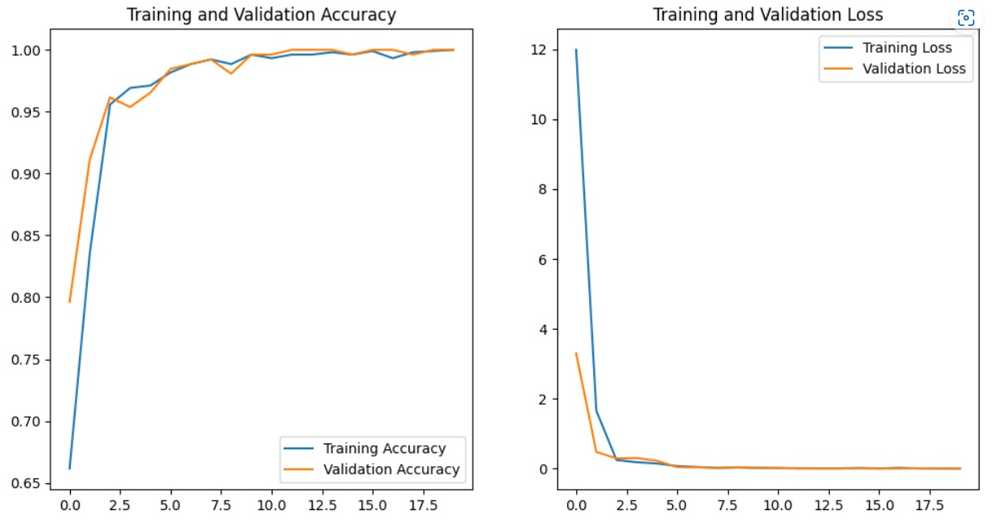

<h1 align="center">
  VeriTrack :spiral_notepad:
</h1>

   <strong>VeriTrack</strong> - A Blockchain-based supply chain management web-app. 
  HackerStellar || Team Runtime Error.

**Problem Statement:** Supply - Chain Management with Blockchain

**VeriTrack** is a blockchain-based platform that leverages <b> distributed ledger technology</b> to enable secure and transparent tracking of goods throughout the supply chain.

### Features
VeriTrack offers a variety of features that enable stakeholders in the  goods industry to track and verify the authenticity, provenance, and quality of goods throughout the supply chain. Some of the key features of VeriTrack include:
- **Decentralized and immutable ledger**: VeriTrack uses a decentralized ledger technology that creates an immutable record of each transaction, ensuring that the data cannot be altered or tampered with.
- **Traceability**: VeriTrack enables stakeholders to track the movement of goods from the point of origin to the point of sale, providing transparency and traceability throughout the supply chain.
- **Authentication**: VeriTrack uses advanced cryptographic techniques to authenticate goods, making it easier to detect counterfeit products and prevent fraud.
- **Provenance verification**: VeriTrack allows stakeholders to verify the origin and history of goods, ensuring that they are ethically sourced and comply with industry standards.
- **Quality control**: VeriTrack enables stakeholders to monitor the quality of goods throughout the supply chain, ensuring that they are handled and transported in accordance with industry standards.

VeriTrack is a blockchain-based platform that uses a variety of technologies to enable secure and transparent tracking of  goods throughout the supply chain. The access levels in VeriTrack include:

1. **Manufacturer**: The manufacturer is responsible for creating the goods and entering them into the VeriTrack system. The manufacturer has full access to the data related to the production of the goods, including quality control, testing, and shipment.

2. **Retailer**: The retailer is responsible for selling the goods to the end customer. The retailer has access to the data related to the sale of the goods, including pricing, inventory, and customer information.

3. **Consumer**: The consumer is the end customer who purchases the  goods. The consumer has access to the data related to the authenticity, provenance, and quality of the goods, including certification and verification information.

## Features
### Blockchain
We are using the Ethers Blockchain to host our Smart Contracts. These Contract ensure that data is stored on the blockchain in a non-tamperable format.
### Machine Learning
We are using Machine Learning to scan images from the manufacturer, retailer and customer in order to provide proof of tamperment and damage at each step.
The model used is *name*
Some of our results with training it:
 

## Resources
<!-- - [Demo Video]() -->
- [GitHub Repository](https://github.com/Jash-Shah/Hackerstellar-Runtime_Error)

## 🤖Tech-Stack

#### Web Development
- NextJS
- Tailwind CSS

#### Blockchain
- Solidity
- Smart Contracts

## 🔮Future Scope and Business Potential
- Smart contracts optimization
- Enhancing Supply Chain Visibility
- Advanced Analytics
- Integration with other systems
- Traceability and Transparency

## 👨‍💻Team Members
- [Vaibhav Patel](https://github.com/noobCoderVP)
- [Akshay Phalke](https://github.com/asphalke07)
- [Toshan Luktuke](https://github.com/toshan-luktuke)
- [Jash Shah](https://github.com/Jash-Shah)
